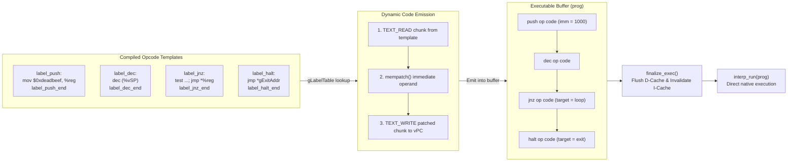

# How Machine Code Inlining Works

**Machine Code Inlining** is a template-JIT dispatch technique implemented by **interp**. Rather than dispatching virtual instructions at runtime through a central loop or indirect table, the inlining engine stitches precompiled native instruction snippets directly into an executable buffer. The resulting buffer is executed as straight-line native machine code with **zero interpreter dispatch overhead**.

---

## Architecture Overview



---

## Execution Stages

### 1. Template Extraction (`interp_init`)
Inside `interp_run(NULL)`, the compiler generates machine instructions for each opcode between two GNU C labels (`&&label_op` and `&&label_op_end`). On startup, `interp_init()` measures the length of each basic block and populates `gLabelTable` with its address and byte size:

```c
#define OP_ADDR(op)  (&&label_##op)
#define OP_SIZE(op)  ((char*)&&label_##op##_end - (char*)&&label_##op)
```

### 2. Chunk Emission (`EMIT_OP`)
When assembling an instruction into the code buffer `vPC`, the VM copies the raw instruction bytes directly from the compiled template:
- `TEXT_READ` copies the template bytes into an aligned temporary buffer on the stack.
- `TEXT_WRITE` writes the chunk into the executable buffer at `vPC`.
- `vPC` is incremented by the chunk length `c->len`.

### 3. In-Memory Immediate Patching (`mempatch`)
Opcodes that accept immediate values (`PUSH`, `JMP`, `LOAD`, etc.) embed a unique placeholder constant inside inline assembly:
- `0xdeadbeef` (32-bit platforms) or `0xdeadbeefdeadbeef` (64-bit platforms), offset by opcode ID.
- `mempatch()` searches the temporary chunk for the placeholder pattern and overwrites it with the real operand (constant value, target label address, or helper function pointer) before copying into `vPC`.

### 4. Memory Allocation (`alloc_exec`)
Executing generated machine code requires memory pages mapped with executable permissions:
- **POSIX (Linux / macOS)**: `mmap()` allocates anonymous pages with `PROT_READ | PROT_WRITE | PROT_EXEC`. On macOS Apple Silicon (ARM64), `MAP_JIT` is combined with `pthread_jit_write_protect_np(0)` to allow thread-safe writing into executable pages.
- **Windows**: `VirtualAlloc()` allocates pages marked `PAGE_EXECUTE_READWRITE`.
- **ESP32**: `heap_caps_malloc(..., MALLOC_CAP_EXEC)` allocates executable internal SRAM.
- **ESP8266**: An aligned scratchpad statically placed in `IRAM_ATTR`.

### 5. Instruction Cache Coherence (`finalize_exec`)
On Harvard architectures (ARM, AArch64, MIPS, RISC-V, Xtensa), CPU Data and Instruction caches are decoupled. Before jumping to the synthesized code, `finalize_exec()` cleans the Data Cache and invalidates the Instruction Cache:
- **GCC / Clang**: `__builtin___clear_cache(start, end)`
- **Windows**: `FlushInstructionCache(GetCurrentProcess(), start, length)`
- **macOS Apple Silicon**: `sys_icache_invalidate(start, length)` and `pthread_jit_write_protect_np(1)`

---

## Supported Architectures & Stubs

The inlining engine uses lightweight architecture-specific assembly macros to load immediates and jump:

| Architecture | Word Size | Immediate Load Pattern | Jump Pattern |
| :--- | :---: | :--- | :--- |
| **x86-64 / x86** | 64 / 32-bit | `mov $(PLACEHOLDER + id), %reg` | `jmp *%reg` |
| **AArch64** | 64-bit | `ldr %reg, 1f; b 2f; .quad ...` | `br %reg` |
| **ARM (32-bit)** | 32-bit | `ldr %reg, 1f; b 2f; .long ...` | `mov pc, %reg` |
| **RISC-V (RV64/RV32)** | 64 / 32-bit | `ld/lw %reg, 1f; j 2f; .balign 8; ...` | `c.jr %reg` |
| **MIPS / MIPSEL** | 32-bit | `bal 1f; .long ...; 1: move ...; lw ...` | `jr %reg` |
| **Xtensa** | 32-bit | `memw; j 2f; .align 4; .long ...; 2: l32r ...` | `jx %reg` |
